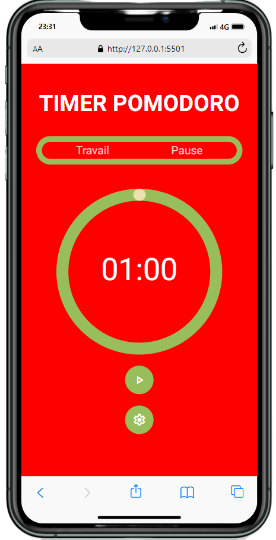

# Pomodoro Timer

This is a simple and responsive Pomodoro Timer built with HTML, CSS, and JavaScript. The project allows users to set custom work and rest durations, start a countdown timer, and visualize their progress using an animated circular timer.

### https://lukathim.github.io/projet_pomodoro_maquette/

## Features
- **Customizable Durations**: Set your own work and rest durations via the settings panel.
- **Responsive Design**: The layout adjusts seamlessly across different screen sizes, from mobile to desktop.
- **Visual Progress**: The circular progress indicator dynamically updates as time counts down.
- **Persistent Settings**: The timer stores the user's work and rest durations using local storage so settings persist across sessions.

## Files

### 1. `index.html`
This is the main HTML file that defines the structure of the Pomodoro Timer. It includes:
- The header displaying the title of the timer.
- The panel to display "Work" and "Rest" status.
- The SVG-based circular timer.
- Buttons for starting the timer, resetting, and opening the settings form.

### 2. `style.css`
This file contains all the styles for the Pomodoro Timer. It includes:
- Global reset and layout styles.
- Specific styles for the timer panel, buttons, and settings form.
- Responsive styles to ensure the layout works well across various devices and screen sizes.
  
**Key Features**:
- Circular SVG progress animation is handled through CSS for stroke offset changes.
- Includes media queries to ensure proper scaling on smaller screens (768px and 480px).

### 3. `pomodoro.js`
This JavaScript file handles all the functionality of the Pomodoro Timer. It includes:
- Timer countdown logic for both work and rest periods.
- Functions to update the circular progress dynamically.
- Event listeners for start, reset, and settings buttons.
- Local storage functionality to save and load the work and rest durations set by the user.

**Main Functions**:
- `funcUpdateTimer()`: Handles the countdown for the timer.
- `funcUpdateProgress()`: Updates the circular progress based on the remaining time.
- Local storage integration to persist user settings.

## How to Use

1. **Clone the repository**:
   ```bash
   git clone <repository-url>

## Screenshots


*Desktop view of the Pomodoro Timer*


*Mobile view of the Pomodoro Timer*