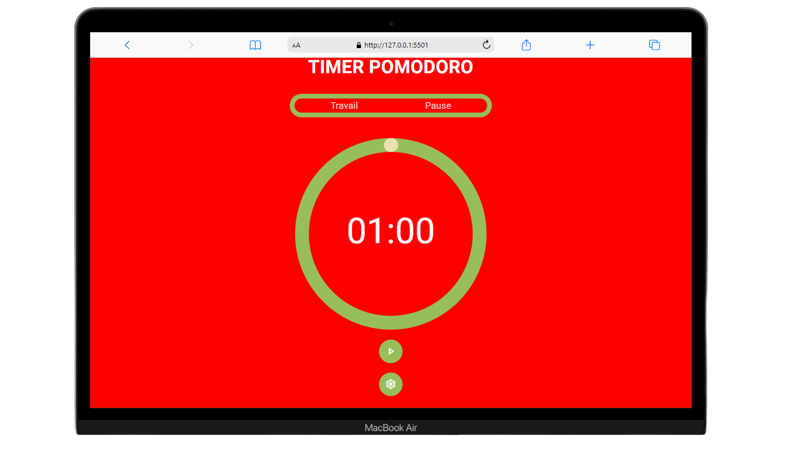

# Pomodoro Timer

Ceci est un **Pomodoro Timer** simple et responsive construit avec **HTML, CSS** et **JavaScript**. Ce projet permet aux utilisateurs de définir des durées personnalisées pour les périodes de travail et de repos, de lancer un compte à rebours, et de visualiser leur progression grâce à un timer circulaire animé.

### [Lien vers le projet](https://lukathim.github.io/projet_pomodoro_maquette/)

## Fonctionnalités
- **Durées personnalisables** : Configurez vos propres durées de travail et de repos via le panneau de paramètres.
- **Design responsive** : Le layout s’adapte parfaitement à différentes tailles d’écran, du mobile au bureau.
- **Progression visuelle** : L’indicateur de progression circulaire se met à jour dynamiquement au fur et à mesure que le temps s'écoule.
- **Paramètres persistants** : Le timer enregistre les durées de travail et de repos de l'utilisateur dans le stockage local, ce qui permet aux paramètres de persister entre les sessions.

## Fichiers

### 1. `index.html`
Il s'agit du fichier HTML principal qui définit la structure du Pomodoro Timer. Il inclut :
- L'en-tête affichant le titre du timer.
- Le panneau pour afficher l'état "Travail" et "Repos".
- Le timer circulaire basé sur SVG.
- Des boutons pour démarrer le timer, réinitialiser, et ouvrir le formulaire de paramètres.

### 2. `style.css`
Ce fichier contient tous les styles pour le Pomodoro Timer. Il inclut :
- Styles de réinitialisation et de mise en page globaux.
- Styles spécifiques pour le panneau du timer, les boutons et le formulaire de paramètres.
- Styles responsives pour garantir que la mise en page fonctionne bien sur divers appareils et tailles d'écran.
  
**Fonctionnalités clés** :
- L'animation de progression circulaire SVG est gérée via CSS pour les changements d'offset du stroke.
- Inclut des media queries pour assurer un bon redimensionnement sur les petits écrans (768px et 480px).

### 3. `pomodoro.js`
Ce fichier JavaScript gère toute la fonctionnalité du Pomodoro Timer. Il inclut :
- Logique de compte à rebours pour les périodes de travail et de repos.
- Fonctions pour mettre à jour dynamiquement la progression circulaire.
- Écouteurs d'événements pour les boutons de démarrage, de réinitialisation et de paramètres.
- Fonctionnalité de stockage local pour sauvegarder et charger les durées de travail et de repos définies par l'utilisateur.

**Fonctions principales** :
- `funcUpdateTimer()`: Gère le compte à rebours du timer.
- `funcUpdateProgress()`: Met à jour la progression circulaire en fonction du temps restant.
- Intégration de stockage local pour persister les paramètres utilisateur.

## Captures d'écran

*Vue de bureau du Pomodoro Timer*

*Vue mobile du Pomodoro Timer*
